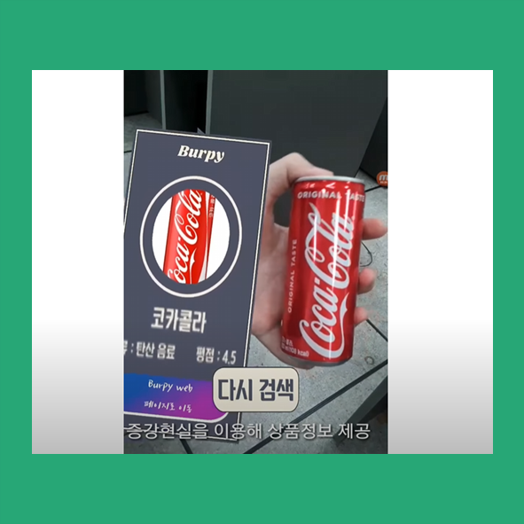

<h1>Burpy Unity App (2018)</h1>

해당 페이지에서 Burpy 프로젝트의 Client App을 소개합니다.

<h2>Tech Stack</h2>
<ul>
  <li>Programming Language</li>
  <ul>
    <li></li>
  </ul>
  <li>Framework</li>
  <ul>
    <li></li>
    <li></li></li>
  </ul>
  <li>Toolkit</li>
  <ul>
    <li></li>
  </ul>
</ul>

<h2>Summary</h2>

<b>이게 무슨 음료야? 무슨 맛이지?</b> 음료를 직접 스캔하여, AR 정보를 얻는 Unity App입니다. 내가 모르는 음료에 대한 맛과 정보를 개봉하지 않고 확인할 수 있습니다. 또한, 새로운 음료에 대한 나의 신선한 경험을 남들에게 알릴 수도 있습니다.

사용자가 음료에 대한 정보를 스캔하여, 촬영된 이미지를 동봉하여 Burpy Image Classification 서버에 Request합니다. 분류가 완료되면, 음료 위키 서버에서 음료 정보를 담은 Response를 받아, AR로 정보를 렌더링합니다.

스캔한 상품이 새로운 상품이라면, 최초 리뷰어가 될 수 있습니다. 이 경우 스캔 직후, 새로운 음료 추가 인터페이스로 위키 서버에 접속하여 음료를 등록할 수 있습니다.

<h2>Detail</h2>

Unity에 Vuforia의 Markless Package를 이용하여 개발하였습니다. 최초 스캔한 이미지를 UnityWebRequest객체로 만들어 Classification 서버로 Request를 보냅니다. 그 후, Classification 서버는 위키 서버에 Request를 요청하고, 위키 서버는 Response (e.g. 음료 이름, 맛, 추천 등등)를 만들어 UnityWebRequest 객체의 프로퍼티로 돌려줍니다. 직후, 스캔했던 음료의 Feature를 기반으로 AR 인터페이스에 UnityWebRequest 프로퍼티에 담긴 음료 정보를 렌더링합니다.

새로운 음료 이미지 및 학습 강화용 이미지는 Google Drive에 다이렉트로 접근하여, Training Data 디렉토리에 저장하도록 설계하였습니다. 이 과정에서 Google Drive API와 Oauth2를 사용하였습니다.

<h3>음료 스캔</h3>

<ol>
  <li>Unity로부터 음료를 스캔하여, 해당 이미지 사진을 Image Classification 서버에 전송합니다.</li>
  <li>Image Classification 서버와 위키 서버가 커뮤니케이션 후, 위키 서버로부터 음료 정보가 담긴 Response를 받습니다.</li>
  <li>Vuforia Object를 통해, 음료 정보가 증강하여 렌더링됩니다.</li>
  <li>사용자는 렌더링된 AR 인터페이스를 통해, 위키 홈페이지로 접속하거나, 모델 강화를 위해 직전에 촬영한 이미지를 학습 데이터로 제출할 수 있습니다.</li>
</ol>

<h3>음료 등록</h3>

<ol>
  <li>음료 스캔 직후, 해당 음료가 있는지 App을 통해 검색합니다.</li>
  <li>이 때, 위키 서버와 Request/Response를 받으며 관련 음료 리스트를 사용자에게 App으로 제공합니다.</li>
  <li>만약, 스캔한 음료와 매치되는 음료가 있다면 사용자는 해당 음료가 명시된 버튼을 누르게 되고, 스캔 직후의 이미지는 학습 데이터로 제출됩니다.</li>
  <li>리스트에 없다면, 음료 등록을 위해서 위키 서버가 브라우저를 통해 연결됩니다. 사용자는 브라우저를 통해 음료 정보를 입력하고, 입력 완료 직후, 스캔 직후 이미지가 학습 데이터로 제출됩니다.</li>
</ol>

<h2>Behind Story</h2>

당시 Unity2017을 사용하였습니다. 이 시기는 기존에 사용하던 WWW 방식 대신, UnityWebRequest 방식을 권고하던 시기로 기억됩니다. 로직의 길이도 UnityWebRequest가 더 간결하고 (짧고), Json을 직접 Raw하게 작업하는 WWW과 달리, UnityWebRequest는 객체 내 변수로 Request를 꾸릴 수 있어서 더욱 편리하였습니다.

Google Oauth2를 이용하면서, Google Playground라는 별도 공간이 있다는 것을 처음 알았습니다. API 다양하게 테스트하라고 놀이터까지 주는 갓글...

<h2>Check This</h2>
<ul>
  <li><a href="https://docs.google.com/document/d/17fB05skh4-5_dkhD0XkSKak9RyiePswib4cddcb-lu0/edit?usp=sharing">개발 내용 문서</a></li>
  <li><a href="https://github.com/boosilguy/BurpyICHeroku">Burpy Image Classification Server</a></li>
</ul>

<h2>프로젝트 영상</h2>

